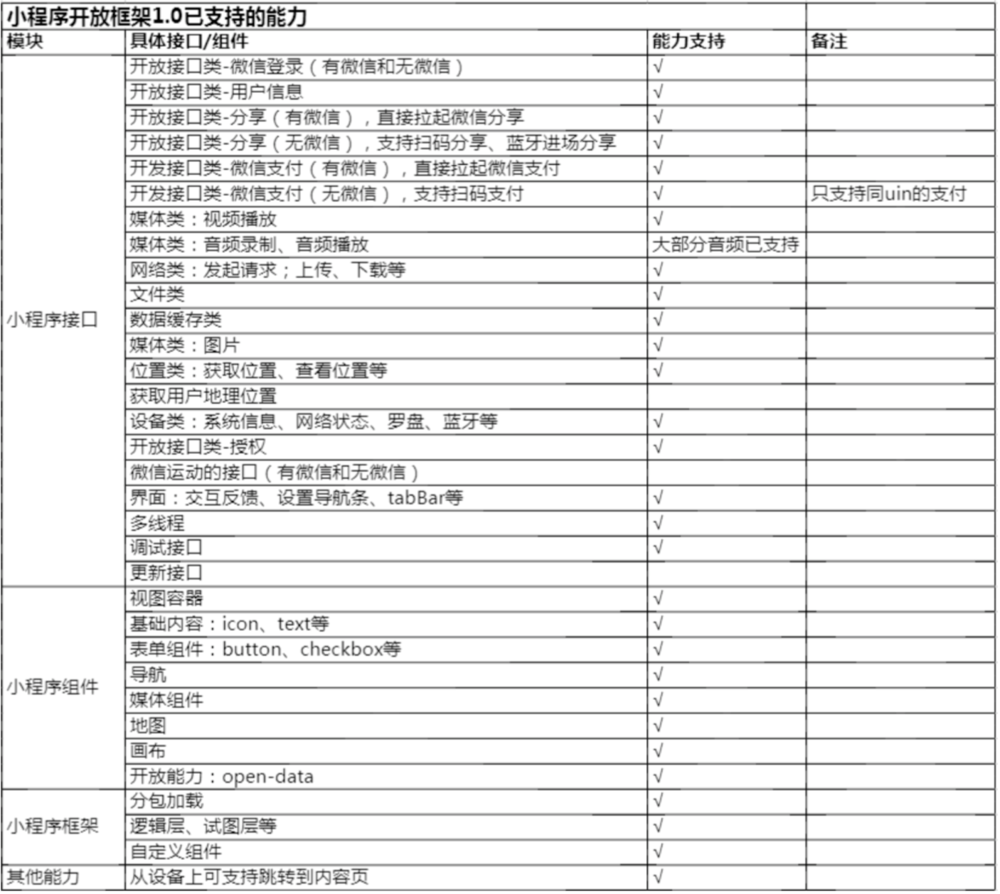

## 小程序开放框架（安卓版）内测接入文档 V0.3

2019.06.24

### 一、产品简介

- 小程序开放框架是指小程序可以在脱离微信环境下运行，尝试将小程序运行在现有的硬件设备上，现文档支持小程序在安卓系统的设备上运行。

- 小程序在硬件设备上的能力，与微信上运行的小程序对齐，依旧可以使用微信登录、微信支付等能力。

### 二、签署保密协议

小程序开放框架在目前在内测邀请阶段，谢绝对外沟通，**请贵司严格对外保密此事**，并签署保密协议，详见《附件1：小程序开放框架双向保密协议》。

签署流程：

1、 请贵公司确认协议条款，填写完整【附件1：小程序开放框架双向保密协议】highlight的几处文本，发回电子版word。

- 请同时填写甲方的签署日期，确保甲方和乙方签署日期保持一致。

2、微信团队法务审核电子版word，协议确认无误后，通知贵公司可以寄出协议。

3、请贵公司先行盖章，一式两份盖章（包括骑缝章）寄出到：广州市海珠区新港中路397 号TIT 创意园北门4 号楼 020-81176888 刘腾。

### 三、开发文档

#### （一）  小程序开放框架接入流程

##### Step 1：请回复此邮件，商户需要提供如下信息：

1.  需要在硬件设备上运行的**小程序昵称和  AppID**，如果没有请到 https://mp.weixin.qq.com/ 注册小程序。
   PS：如果是横屏设备，请注意将小程序做横屏适配

2.  为了给予设备开通运行小程序的权限，请提前在微信开放平台注册的**移动应用  AppID**，请邮件发回移动应用的 AppID。
   在微信开放平台->移动应用开发 上创建一个移动应用（详见<https://open.weixin.qq.com/cgi-bin/frame?t=home/app_tmpl&lang=zh_CN>）, 审核通过后，可得到移动应用的 AppID；
   
3.  提前在https://git.code.tencent.com注册账号，并在邮件附上账号(个人设置->账号->用户名)。
  以便添加Apk&Sample&Doc(https://git.code.tencent.com/wmpf/wmpf_demo_external)等查看下载权限。

##### Step 2 ：在目标设备上运行小程序

微信会邮件给到 APK 文件，用于运行小程序，商户需将该 APK 安装到 Android 系统的设备中，安装成功后，硬件设备上会有应用「微信小程序框架」(WMPF)，该应用包含了小程序运行时需要的环境，并能响应启动小程序的请求。

商户需要编写发送请求的应用，具体流程如下：
**0 发送设备激活请求 IPCInvokerTask_IPCInvokerTask_ActivateDevice**：
注：ProductId，keyVersion，deviceId和signature的获取流程和方式见附件《硬件注册流程》，以此保证设备合法的前提下，未登录时也可运行小程序。

代码示例如下：
```java
WMPFActivateDeviceRequest request = new WMPFActivateDeviceRequest()
request.baseRequest = WMPFBaseRequestHelper.checked()
request.productId = 1
request.keyVersion = 2
request.deviceId = "Your DEVICE ID"
request.signature = "Your SIGNATURE"
WMPFIPCInvoker.invokeAsync(
      request,
      IPCInvokerTask_ActivateDevice.class,
      new IPCInvokeCallback<WMPFActivateDeviceResponse>() {
          @Override
          public void onCallback(WMPFActivateDeviceResponse response) {
              // process result
          }
      });
```

**1 发送授权请求 IPCInvokerTask_AuthorizeNoLogin或者是IPCInvokerTask_Authorize**：

注：DeviceTicket和Ticket的获取流程和方式见WMPF Client Demo的示例代码OpenSdkTestUtil.java

代码示例如下：

```java
WMPFAuthorizeNoLoginRequest request = new WMPFAuthorizeNoLoginRequest()
request.baseRequest = WMPFBaseRequestHelper.checked()
request.ticket = "Your SDK Ticket"
request.appId = "Your AppId"
request.scope = "snsapi_userinfo,snsapi_runtime_apk"
WMPFIPCInvoker.invokeAsync(
      request,
      IPCInvokerTask_AuthorizeNoLogin.class,
      new IPCInvokeCallback<WMPFAuthorizeNoLoginResponse>() {
          @Override
          public void onCallback(WMPFAuthorizeNoLoginResponse response) {
              // process result
          }
      });
```

```java
WMPFAuthorizeRequest request = WMPFAuthorizeRequest()
request.baseRequest = WMPFBaseRequestHelper.checked()
request.ticket = ticket
request.appId = appId // OpenSDK AppId for App
request.scope = "snsapi_userinfo,snsapi_runtime_apk"
WMPFIPCInvoker.invokeAsync(
      request,
      IPCInvokerTask_Authorize.class,
      new IPCInvokeCallback<WMPFAuthorizeResponse>() {
          @Override
          public void onCallback(WMPFAuthorizeResponse response) {
              // process result
          }
      });
```

**2.发送启动小程序请求 IPCInvokerTask_LaunchWxaApp：**
注：仅在仅在激活设备成功的前提下能调用成功
代码示例如下：

```java
WMPFLaunchWxaAppRequest request = new WMPFLaunchWxaAppRequest()
request.baseRequest = WMPFBaseRequestHelper.checked()
request.appId = "Your AppId"
request.path = "Target Wxa Path"
request.isNoLogin = true

WMPFIPCInvoker.invokeAsync(
      request,
      IPCInvokerTask_LaunchWxaApp.class,
      new IPCInvokeCallback<WMPFLaunchWxaAppResponse>() {
          @Override
          public void onCallback(WMPFLaunchWxaAppResponse response) {
              // process result
          }
      });
```

**3.当不需要运行小程序的时候，可发送取消授权请求: IPCInvokerTask_Deauthorize：**

代码示例如下：

```java
WMPFDeauthorizeRequest request = new WMPFDeauthorizeRequest()
request.baseRequest = WMPFBaseRequestHelper.checked()

WMPFIPCInvoker.invokeAsync(
      request,
      IPCInvokerTask_Deauthorize.class,
      new IPCInvokeCallback<WMPFDeauthorizeResponse>() {
          @Override
          public void onCallback(WMPFDeauthorizeResponse response) {
              // process result
          }
      });
```

为快速体验启动小程序的流程，可安装附件提供的示例DEMO，运行小程序。

但正式环境中，需要根据上述流程去编写发送请求的应用（可根据需要自定义启动小程序的交互与界面），具体实现见示例DEMO的代码。


#### （二）如何开发小程序

1.  API 在小程序框架内与微信客户端内的输入输出一致，按照小程序文档中方式使用即可；
2.  有部分 API 可能尚未支持，例如扫码/多线程，具体支持能力请查阅附录 《开放框架1.0能力表》
3.  开发工具同样为微信开发者工具。

#### （三）硬件设备上如何调试小程序

安装微信开发者工具，打开项目或者是修改代码后，点击「预览」即可将本地代码上传到微信后台服务器，生成二维码。开发者在硬件设备的发送请求应用上，可通过IPCInvokerTask_LaunchWxaAppByQrCode的请求，来进行真机调试。

具体实现可参考示例DEMO代码-远程调试：

```java
WMPFLaunchWxaAppByQRCodeRequest request = new WMPFLaunchWxaAppByQRCodeRequest()
request.rawData = "QRCODE DATA";
WMPFIPCInvoker.invokeAsync(
      request,
      IPCInvokerTask_LaunchWxaAppByQrCode.class,
      new IPCInvokeCallback<WMPFLaunchWxaAppByQRCodeResponse>() {
          @Override
          public void onCallback(WMPFLaunchWxaAppByQRCodeResponse response) {
              // process result
          }
      });
```

### 附录

1.WMPF Client Demo.Apk，链接中下载

2.WMPF Client Demo的示例代码，链接中下载

3.《开放框架1.0能力表》


4.《硬件注册步骤》
