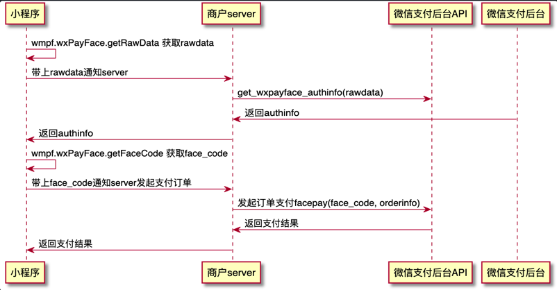
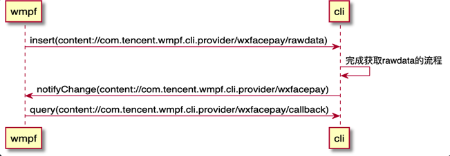

# WMPF调起微信支付人脸支付(WxFacePay)协议

### 前端接口
#### 调用流程


#### wmpf.wxFacePay.canIUse
同步接口，用于判断设备是否支持人脸支付。

##### 示例代码
```js
    if (wmpf && wmpf.wxFacePay && wmpf.wxFacePay.canIUse()) {
        console.log("wxFacePay is supported")
    }
```

#### wmpf.wxFacePay.getRawData
异步接口。
无传入参数，返回参数见[https://pay.weixin.qq.com/wiki/doc/wxfacepay/develop/sdk-android.html#%E8%8E%B7%E5%8F%96%E6%95%B0%E6%8D%AE-getwxpayfacerawdata]

##### 示例代码
```js
    let invokeArgs = {}
    // ... fill invokeArgs
    wmpf.wxFacePay.getRawData(
        Object.assign({
            success: function(res) {
                console.log("getRawData return " + res.return_code)
                console.log("getRawData return " + res.return_msg)
                console.log("getRawData return " + res.rawdata)
            }
        }, invokeArgs)
    )
```

#### wmpf.wxFacePay.getFaceCode
异步接口。
传入参数及返回参数见[https://pay.weixin.qq.com/wiki/doc/wxfacepay/develop/sdk-android.html#%E4%BA%BA%E8%84%B8%E6%94%AF%E4%BB%98%E5%87%AD%E8%AF%81-getwxpayfacecode]

##### 示例代码
```js
    let invokeArgs = {}
    // ... fill invokeArgs
    wmpf.wxFacePay.getFaceCode(
        Object.assign({
            success: function(res) {
                console.log("getRawData return " + res.return_code)
                console.log("getRawData return " + res.return_msg)
                console.log("getRawData return " + res.face_code)
            }
        }, invokeArgs)
    )
```


### 客户端协议
wmpf客户端与wmpf-cli客户端使用contentprovider和uri:"content://com.tencent.wmpf.cli.provider/wxfacepay"进行数据交互。

#### canIUse封装
使用call操作。

##### wmpf调用代码
```kotlin
    Context.call(
        uri="content://com.tencent.wmpf.cli.provider/wxfacepay",
        method="wxFacePay_canIUse",
        arg=null, extras=null
    )
```

##### wmpf-cli返回示例代码
```kotlin
    override fun call(method: String, arg: String?, extras: Bundle?): Bundle? {
        when (method) {
            "canIUse" -> return Bundle().apply { putBoolean("canIUse", true) }
        }
    }
```

#### getRawData封装

##### 调用流程

- 注1: wmpf在整个流程中的角色是透传小程序的入参和客户端的返回参数给小程序，故各字段名及含义需由wmpf-cli保证对齐微信支付文档的定义
- 注2: wmpf每次调用都会生成唯一的\_\_invoke_id\_\_并插入到传给wmpf-cli的ContentValues中，作为调用唯一标识
- 注3: wmpf-cli需要支持query "content://com.tencent.wmpf.cli.provider/wxfacepay/callback/${\_\_invoke_id\_\_}"以支持wmpf查询特定调用的结果

##### ContentValues字段说明
| 参数               | 类型   | 说明             |
|-------------------|--------|-----------------|
| \_\_invoke_id\_\_ | string | 调用id，用于后续获取对应的返回数据，每次调用的id都不一样 |
| 其他               |        | 其他参数对齐微信支付文档的定义 |


#### getFaceCode封装
大体流程与getRawData类似，insert的uri改为"content://com.tencent.wmpf.cli.provider/wxfacepay/facecode", callback的uri保持为"content://com.tencent.wmpf.cli.provider/wxfacepay/callback"