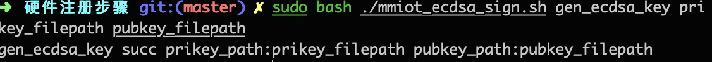
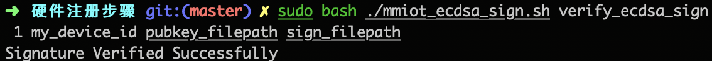

### 硬件注册步骤

#### 1.提供产品英文名称和AppId，在微信后台注册(提供接口or邮件)，换回productID
例：微信相框接入智联平台，产品英文名称为："wechat_album"，分配返回产品标识ProductId=1

#### 2.运行工具生成公私钥，在微信后台注册公钥(提供接口or邮件)，换回KeyVersion
a.公私钥生成方法:
用法：sudo bash ./mmiot_ecdsa_sign.sh gen_ecdsa_key prikey_filepath pubkey_filepath
例：为相框生成一对签名公私钥

可看到，执行工具成功后，终端输出gen_ecdsa_key succ prikey_path:prikey_filepaht pubkey_path:pubkey_filepath，且在对应目录已生成两个文件，分别保存公钥与私钥
b.注册公钥：
例：将前述pubkey_filepath公钥文件以接口或者邮件传给微信后台，返回KeyVersion

#### 3.提供设备唯一DeviceID，在微信后台注册(提供接口)
例：DeviceID列表格式为每行一个DeviceId，以\n结尾

#### 4.运行工具，输入私钥，生成签名字符串Signature
调用mmiot_ecdsa_sign工具，输入私钥文件，生成每个设备的签名Signature。
用法：sudo bash ./mmiot_ecdsa_sign.sh gen_ecdsa_sign ProductId my_deivice_id prikey_filepath sign_filepath
例：为微信相框DeviceId为my_deivice_id的设备生成签名

验证签名是否正确
用法：sudo bash ./mmiot_ecdsa_sign.sh verify_ecdsa_sign ProductId my_device_id pubkey_filepath sign_filepath

可看到，执行工具后，终端输出：gen_ecdsa_sign succ sign_file_path:sign_filepath， 且在对应路径下生成了该设备的签名文件。

#### 5.将字符串Signature烧入设备
将Signature存入设备安全区域即可，但考虑到有现存设备无法通过烧入的方式存储Signature，也可存在服务器后台，但需要三方App保证安全性。

#### 6.三方App自己获取Signature，传入productID, KeyVersion, DeviceId, Signature调用WMPF激活接口.

Usage:
mmiot_ecdsa_sign.sh gen_ecdsa_key <private_key_file_path> <public_key_file_path>
mmiot_ecdsa_sign.sh gen_ecdsa_sign <product_id> <sn> <private_key_file_path> <signature_file_path>
mmiot_ecdsa_sign.sh verify_ecdsa_sign <product_id> <sn> <public_key_file_path> <signature_file_path>

注：
a.脚本基于openssl命令行，要求执行机器环境已安装openssl，建议是linux环境下.
b.相关接口见接口文档
c.上传公钥时"-----BEGIN PUBLIC KEY-----"等字符串不要删除